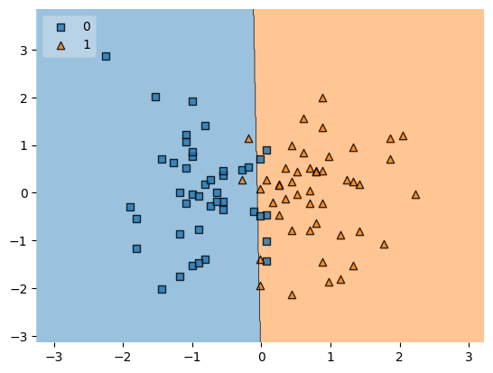

# Student placement predict ML 

End to end project to predict placement of the students based on IQ and CGPA

Steps to implement ML (or MLDLC)
* Preprocess + EDA + Feature Selection
* Extract input and output cols
* Scale the values
* Train test split
* Train the model
* Evaluate the model/model selection
* Deploy the model

